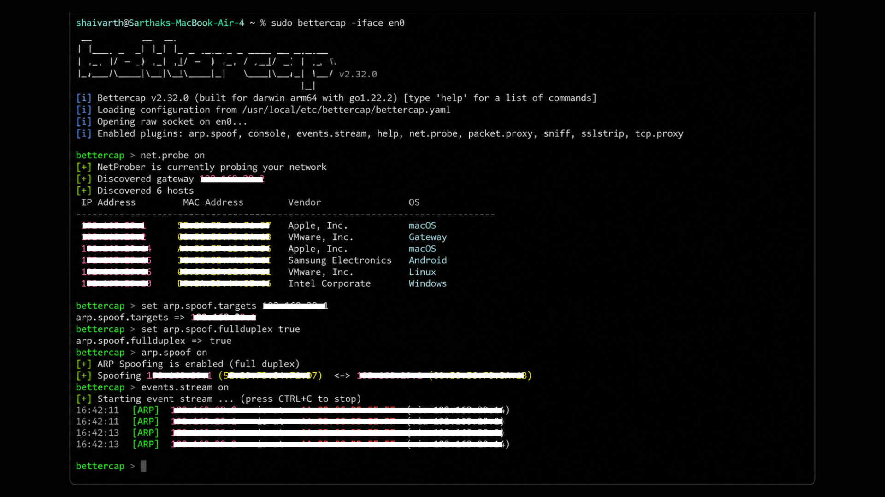
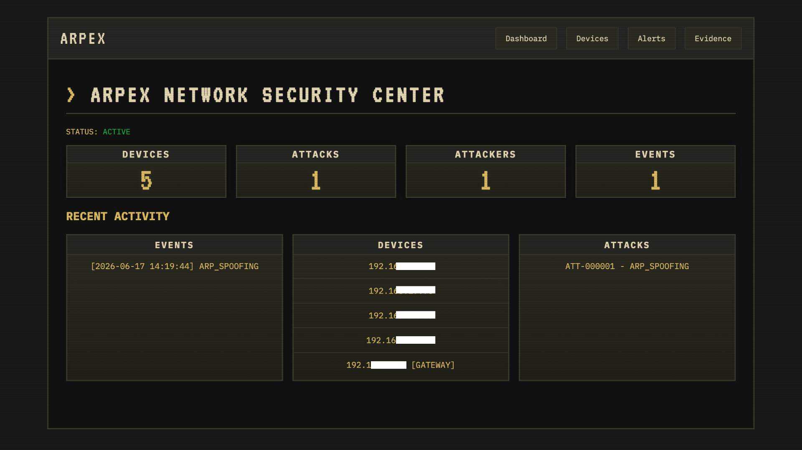
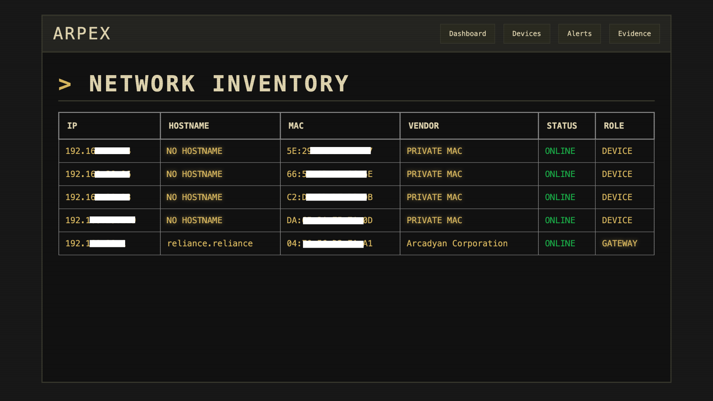
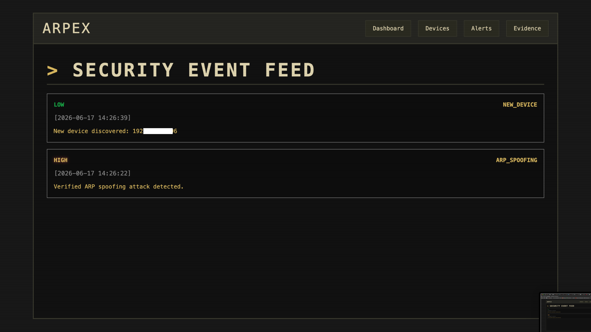
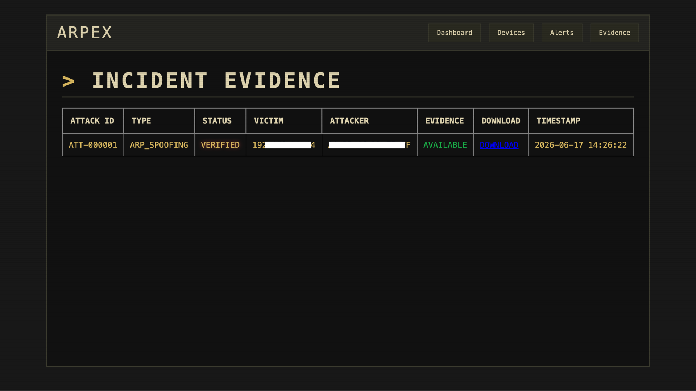

# ARPEX
### Advanced ARP Spoofing Detection & Network Monitoring System

> A Python-based cybersecurity tool that monitors local network traffic, detects suspicious ARP mapping changes, verifies anomalies to reduce false positives, and provides forensic evidence through a web dashboard.


---

## Overview

ARPEX is a network security project designed to monitor ARP activity on local networks.

The system continuously discovers devices, maintains an IP-to-MAC mapping baseline, observes ARP traffic in real time, verifies suspicious mapping changes, records security events, and stores packet captures (PCAP) for forensic analysis.

Unlike simple packet sniffers, ARPEX combines passive monitoring with active verification and incident tracking through a web-based dashboard.

### Arp Spoofing using bettercap


## Features

- Device discovery using ARP scanning
- Real-time ARP packet monitoring
- Baseline IP → MAC mapping cache
- Detection of suspicious mapping changes
- Verification workflow to reduce false positives
- Device inventory with vendor information
- Online/offline presence monitoring
- Security event logging
- Attack and attacker tracking
- PCAP evidence capture and download
- SQLite-backed persistent storage
- Flask-powered monitoring dashboard

---

# Dashboard

## Main Dashboard



Displays:
- Device count
- Attack count
- Event count
- Recent activity feed
- High-level network overview

---

## Device Inventory



Shows discovered assets including:
- IP address
- MAC address
- Vendor
- Gateway status
- Online/offline state

---

## Security Events



Provides chronological visibility into:
- Device discovery
- Network anomalies
- Verification results
- Security notifications

---

## Incident Evidence



Displays recorded incidents with:
- Attack ID
- Verification status
- Victim information
- Attacker information
- Timestamp
- Downloadable PCAP evidence

---

# Technology Stack

- Python
- Flask
- Scapy
- SQLite
- HTML
- CSS
- Jinja2

---

# Project Structure

```text
ARPEX/
│
├── arpex/
│   ├── detector.py
│   ├── database.py
│   ├── fingerprint.py
│   └── ...
│
├── dashboard/
│   ├── app.py
│   └── templates/
│
├── captures/
├── data/
├── main.py
└── requirements.txt
```

---

# How It Works

1. Discover devices on the local network.
2. Build an IP-to-MAC baseline.
3. Continuously monitor ARP traffic.
4. Detect unexpected mapping changes.
5. Verify suspicious observations.
6. Record events and attacks.
7. Capture packet evidence for later analysis.
8. Present findings through the dashboard.

---

# Running ARPEX

```bash
git clone https://github.com/Shaivarth/ARPEX.git
cd ARPEX

pip install -r requirements.txt

python3 main.py
```

Start the dashboard:

```bash
python3 dashboard/app.py
```

---

# Notes

- ARPEX performs passive monitoring and verification of ARP activity on local networks.
- The project is intended for educational, research, and defensive security purposes.
- Dashboard screenshots included in this repository are captured from demonstration environments used to showcase the interface.

---

# Future Improvements

- Multi-threaded verification pipeline
- Email/Slack alerting
- SIEM integration
- Historical trend visualizations
- Exportable incident reports
- Multi-interface monitoring
- Enhanced attacker attribution

---

# License

This project is released under the MIT License.

